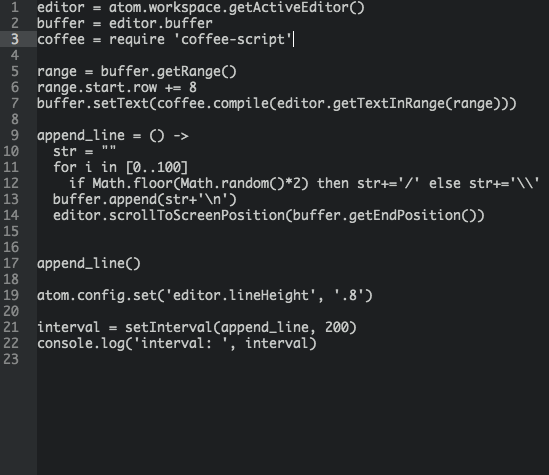

# eval-selection package for the Atom editor

1. Select some code
2. Hit f5
3. ???
4. Your js or coffeescript code is evaluated and result logged to developer console

Hitting f5 with no text selected, evals the current line.

It's eerily like the Acme editor. Write code snippets that do stuff in your editor O.o

Most of this code is taken from [coffee-eval](https://atom.io/packages/coffee-eval)

### In the demo above ###
Lines 1-7, written in coffeescript, are evaluated. They take the rest of the text in the editor and compile it to js.
The js code is then selected and run.
The result is an implementation of the classic 10PRINT program.
